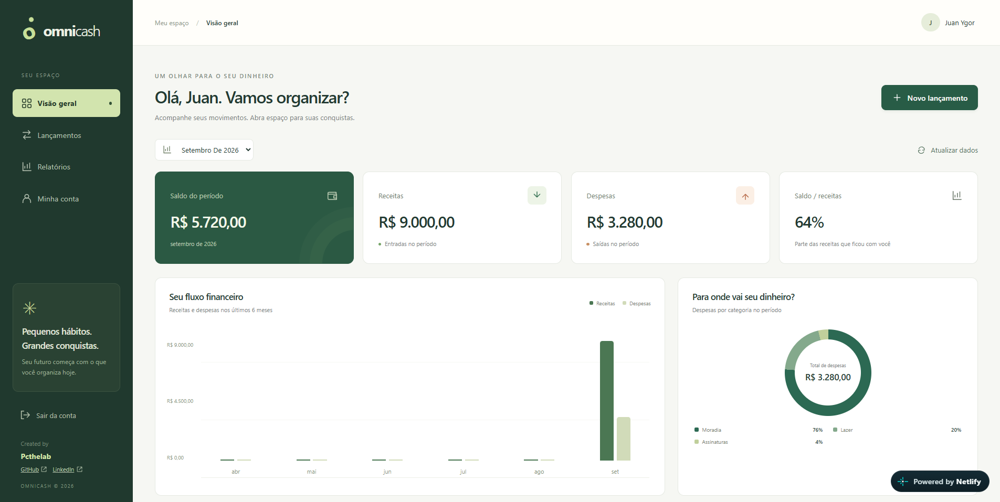

# OmniCash

**Seu dinheiro. Sua vida. Em equilíbrio.**

Organize receitas e despesas, acompanhe o saldo e entenda seus hábitos financeiros
em uma interface em português, pensada para desktop e celular.

[Acessar o aplicativo](https://omnicash.netlify.app) · [Funcionalidades](#funcionalidades) · [Executar localmente](#executar-localmente) · [Documentação](#documentação) · [Direitos autorais](#direitos-autorais)


Desenvolvido por **[Pcthelab](https://github.com/Pcthelab)** · [LinkedIn](https://www.linkedin.com/in/pcthelab)

## Funcionalidades

| Área | O que você encontra |
| --- | --- |
| Visão geral | Tela inicial com saldo, receitas, despesas, relação saldo/receitas e distribuição das despesas por categoria |
| Lançamentos | Área dedicada para criar, editar, excluir, buscar e filtrar movimentações; oito registros por página |
| Relatórios | Evolução de receitas e despesas em seis meses, categorias e exportação do período |
| Exportação | CSV com todas as movimentações filtradas, inclusive as de outras páginas |
| Minha conta | Edição do nome e saída da sessão |
| Autenticação | Cadastro, login com senha, recuperação de senha e login Google; os dois últimos dependem de configuração externa |
| Experiência mobile | Navegação inferior, cards responsivos, campos alinhados e formulário com data e valor em uma coluna no celular |

Os lançamentos pertencem ao usuário autenticado. O backend inicializa **13 categorias
padrão**, sem inserir movimentações fictícias nas contas. Valores são exibidos em
reais e as datas dos lançamentos são tratadas como datas locais.

## Conheça a interface



As imagens são capturas fornecidas pelo autor. O painel acima registra uma versão
anterior à separação das telas: na versão atual, a lista fica em **Lançamentos** e
o gráfico de evolução em **Relatórios**. A tela inicial concentra o resumo financeiro.

## Tecnologias e arquitetura

| Camada | Tecnologias |
| --- | --- |
| Frontend | React 19, Vite 8, JavaScript e CSS responsivo |
| Backend | Java 21, Spring Boot 4.1.1, Spring Security e Bean Validation |
| Persistência | Spring Data JPA/Hibernate e PostgreSQL |
| Autenticação | JWT, BCrypt, Google Identity Services e recuperação por e-mail via Resend |
| Qualidade | Testes Java com H2, testes Node.js, Oxlint e testes de navegador com Playwright |

O backend separa domínio, casos de uso e infraestrutura. O frontend consome a API
HTTP e calcula filtros, paginação e gráficos no cliente. Detalhes e limites estão
no [guia de arquitetura](docs/architecture.md).

```text
OmniCash/
├── backend/                # API, Maven Wrapper, Dockerfile e testes Java
├── frontend/               # Interface, lockfile npm e testes de navegador
├── docs/
│   ├── images/             # Capturas usadas neste README
│   ├── api.md              # Contratos HTTP
│   ├── architecture.md     # Camadas e fluxo de dados
│   ├── development.md      # Desenvolvimento e entrega
│   └── mvp-review.md       # Recursos, integrações e limitações
├── compose.yaml            # Entrada do PostgreSQL local pela raiz
├── start-backend.cmd       # Atalho Windows para a API
├── start-frontend.cmd      # Atalho Windows para o Vite
├── SECURITY.md             # Configuração privada e relato de vulnerabilidades
└── LICENSE                 # Direitos reservados e condições de uso
```

## Executar localmente

As instruções abaixo destinam-se ao titular e a pessoas autorizadas, conforme
as [condições de uso](LICENSE).

**Pré-requisitos:** JDK 21, Node.js 22.12+ compatível com Vite 8 e Docker com Compose.
A primeira execução precisa de acesso à internet para baixar dependências e a
imagem do PostgreSQL. Não é necessário instalar Maven: use o wrapper do projeto.

### 1. Backend

Com Docker Desktop em execução, na raiz do repositório:

```powershell
.\start-backend.cmd
```

Ou, diretamente em `backend/`:

```powershell
.\mvnw.cmd spring-boot:run
```

No Linux/macOS, use `sh ./mvnw spring-boot:run` dentro de `backend/`.
O Spring Boot inicia o PostgreSQL do Compose na porta **5433** e a API na porta
**8080**. O Compose local contém credenciais exclusivamente de desenvolvimento.

### 2. Frontend

Em outro terminal, a partir da raiz:

```powershell
cd frontend
npm ci
npm run dev
```

Abra o endereço informado pelo Vite, normalmente [localhost:5173](http://localhost:5173).
O proxy de desenvolvimento encaminha a API para `http://localhost:8080`.
Após instalar as dependências, o atalho `.\start-frontend.cmd` também funciona pela raiz.

**Não é necessário criar um `.env` para o fluxo local padrão.** O arquivo
[`frontend/.env.example`](frontend/.env.example) é um modelo sem segredos;
`VITE_API_URL` vazio usa a mesma origem. Para outra API, configure essa variável
no ambiente de build e permita a origem do frontend no CORS do backend.

### Integrações e publicação

Login Google e recuperação de senha são habilitados pelas configurações do backend.
Sem elas, os controles opcionais ficam ocultos. Veja as variáveis e o passo a passo
no [guia de ativação](docs/mvp-review.md#ativar-no-render-e-na-netlify).

O build do frontend fica em `frontend/dist/`; o pacote Java, em `backend/target/`.
Credenciais de produção devem ser configuradas no provedor, nunca no código.
O Spring Boot não lê `.env` automaticamente e variáveis `VITE_*` são públicas.
Consulte [desenvolvimento e entrega](docs/development.md) e [segurança](SECURITY.md).

## Verificação

Na raiz:

```powershell
npm --prefix frontend run lint
npm --prefix frontend test
npm --prefix frontend run build
cd backend
.\mvnw.cmd clean test
```

Os testes Java usam H2 em memória e cobrem, entre outros fluxos, autenticação HTTP,
recuperação, revogação de sessão e validação de tokens Google. Os testes Node.js
cobrem cálculos financeiros, filtros, CSV, configuração da API e regras de senha.

Os testes de navegador verificam o layout entre **320 e 1440 px**, o campo de data,
foco, navegação e salvamento com API simulada. Há também um smoke test com API real.
Instruções para Chromium/Edge e WebKit estão no [README do frontend](frontend/README.md#testes-de-navegador).
Emulação de navegador não substitui a validação em um aparelho físico.

## Documentação

- [Backend](backend/README.md): execução, variáveis e pacote Java.
- [Frontend](frontend/README.md): telas, componentes, regras e testes de navegador.
- [API HTTP](docs/api.md): autenticação, endpoints, exemplos e erros.
- [Arquitetura](docs/architecture.md): responsabilidades e fluxo de dados.
- [Desenvolvimento e entrega](docs/development.md): configuração local e produção.
- [Revisão do MVP](docs/mvp-review.md): integrações implementadas e pendências conhecidas.
- [Segurança](SECURITY.md): cuidado com segredos e como relatar vulnerabilidades.

Metas, recorrência, integração bancária e CRUD de categorias não estão implementados.
Migrações versionadas, backups, observabilidade e limitação de tentativas de login
continuam entre as evoluções necessárias para uma operação mais robusta.

## Direitos autorais

**© 2026 Pcthelab. Todos os direitos reservados.**

O código é publicado para apresentação do projeto e não possui licença de código
aberto. Uso, modificação, redistribuição ou exploração comercial dos materiais
originais exigem autorização escrita do titular, ressalvadas as permissões legais,
os termos do GitHub e as licenças de terceiros. Dar crédito não substitui autorização.
Leia o [aviso completo](LICENSE).

Por ser público, o repositório permite visualização e forks nos termos do GitHub;
um aviso autoral não bloqueia tecnicamente cópias. Veja a
[orientação do GitHub sobre licenciamento](https://docs.github.com/en/repositories/managing-your-repositorys-settings-and-features/customizing-your-repository/licensing-a-repository).

Para autorizações, propostas e contato: **[LinkedIn](https://www.linkedin.com/in/pcthelab)** · **[GitHub](https://github.com/Pcthelab)**.
