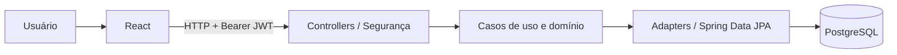

# Arquitetura

O repositório reúne React/Vite e Spring Boot em módulos independentes, ligados
por contratos HTTP.

## Backend

| Pasta | Responsabilidade |
| --- | --- |
| `application/usecase` | Cadastro, lançamentos, saldo e categorias |
| `domain/model` | Usuário, categoria, lançamento e resumo |
| `domain/gateway` e `domain/repository` | Contratos de acesso a dados |
| `domain/exception` | Exceções de domínio |
| `infrastructure/persistence/adapter` | Implementações dos contratos |
| `infrastructure/persistence/entity` | Entidades JPA e mapeadores |
| `infrastructure/persistence/repository` | Interfaces Spring Data |
| `infrastructure/security` | JWT, BCrypt e acesso |
| `infrastructure/web` | Controllers, DTOs e erros HTTP |

A separação em camadas é parcial: alguns controllers acessam repositórios
diretamente e o caso de uso de atualização recebe um DTO HTTP. Uniformizar esses
fluxos com comandos de aplicação é uma evolução possível. O namespace
`OmniCash.api` e os endpoints foram preservados na organização estrutural.

## Frontend e dados

`App.jsx` coordena sessão, navegação, carregamento e painel. `pages/` contém
autenticação e perfil; `components/` reúne elementos reutilizáveis. `api.js`
centraliza HTTP e token. `lib/finance.js` isola cálculos, filtros, datas e CSV.

O login retorna JWT com validade de um dia, mantido no `localStorage` e enviado
como Bearer. A API associa lançamentos ao usuário identificado pelo token.
O backend inicializa 13 categorias padrão.

Filtros, paginação e relatórios são calculados no cliente. O saldo por período
da interface difere do saldo de todo o histórico retornado pela API.

## Ambiente local

O Compose define apenas PostgreSQL. Java e Node rodam fora dos containers.
O Compose raiz inclui o do backend com nome de projeto `backend`, permitindo
executar pela IDE e pelo terminal sem mudar a localização dos arquivos.
O proxy do Vite é exclusivo de desenvolvimento; o build estático exige roteamento
HTTP próprio na entrega.
